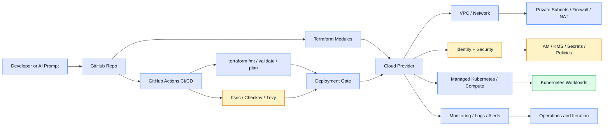
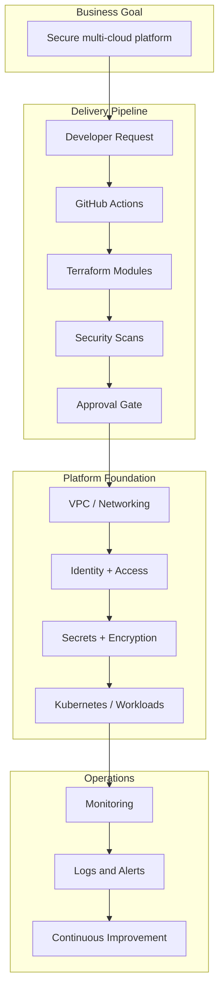

# Cloud IAP

Infrastructure as Prompt for secure, repeatable multi-cloud platform delivery.

This repository is a production-oriented starter for teams who want to deploy cloud infrastructure using a consistent, reusable, and policy-aware workflow. It is designed to help other engineers adopt the code quickly without requiring deep tribal knowledge.

## Why this repository exists

This project turns infrastructure requests into structured, auditable platform assets. It combines:
- Terraform modules
- Kubernetes deployment patterns
- GitHub Actions automation
- security and policy validation
- clear documentation for team handoff

The goal is to make infrastructure easier to understand, reuse, and ship across teams.

## Who this is for

This repository is useful for:
- platform engineers
- cloud architects
- DevOps engineers
- security-conscious delivery teams
- teams standardizing on enterprise cloud patterns

## Repository overview

- [AGENT.md](AGENT.md) — AI operational behavior and delivery expectations
- [SPECS.md](SPECS.md) — desired platform and workload specification
- [SKILLS.md](SKILLS.md) — enterprise engineering standards
- [RULES.md](RULES.md) — guardrails for compliance and security
- [ARCHITECTURE.md](ARCHITECTURE.md) — architecture summary
- [terraform](terraform) — cloud Terraform code and modules
- [kubernetes](kubernetes) — deployment manifests and cluster patterns
- [pipelines](pipelines) — CI/CD templates for automation
- [policies](policies) — security scanning and policy configuration
- [docs](docs) — onboarding, usage, and operational guidance
- [examples](examples) — sample implementations or reference patterns
- [scripts](scripts) — automation helpers and utilities

## Quick start

1. Read the docs in this order:
   - [docs/GETTING_STARTED.md](docs/GETTING_STARTED.md)
   - [docs/USAGE.md](docs/USAGE.md)
   - [docs/DEPLOYMENT_CHECKLIST.md](docs/DEPLOYMENT_CHECKLIST.md)
   - [docs/CONTRIBUTING.md](docs/CONTRIBUTING.md)
   - [docs/RELEASE_PROCESS.md](docs/RELEASE_PROCESS.md)
2. Choose a cloud target under [terraform](terraform)
3. Review variables and module structure
4. Initialize and validate the infrastructure
5. Apply the code in a dev or sandbox environment
6. Use the CI pipeline or run the commands locally
7. Copy [.env.example](.env.example) to a secure local env file and fill in your environment values
8. For production-style usage, review the backend templates under [terraform/backends](terraform/backends) and the example environment files under [terraform/environments](terraform/environments)

## Backend and environment examples

The repository includes starter backend and environment layering patterns for multiple provider types:

- AWS S3 + DynamoDB backend: [terraform/backends/aws-s3-dynamodb.hcl](terraform/backends/aws-s3-dynamodb.hcl)
- Azure Storage backend: [terraform/backends/azure-storage.hcl](terraform/backends/azure-storage.hcl)
- GCP Storage backend: [terraform/backends/gcp-storage.hcl](terraform/backends/gcp-storage.hcl)
- Environment examples: [terraform/environments](terraform/environments)

Example for AWS:

```bash
cd terraform/aws
terraform init -backend-config=../backends/aws-s3-dynamodb.hcl
terraform plan -var-file=../environments/dev/terraform.tfvars
```

## Multi-cloud CI pattern

This repo supports a cloud-agnostic delivery model through provider-specific GitHub Actions workflows:

- [.github/workflows/terraform-aws.yml](.github/workflows/terraform-aws.yml)
- [.github/workflows/terraform-azure.yml](.github/workflows/terraform-azure.yml)
- [.github/workflows/terraform-gcp.yml](.github/workflows/terraform-gcp.yml)
- [.github/workflows/terraform-matrix.yml](.github/workflows/terraform-matrix.yml)

See [docs/multi-cloud-pattern.md](docs/multi-cloud-pattern.md), [docs/CLOUD_SETUP.md](docs/CLOUD_SETUP.md), [docs/AWS_WORKING_SESSION.md](docs/AWS_WORKING_SESSION.md), and [docs/ADR-cloud-agnostic-design.md](docs/ADR-cloud-agnostic-design.md) for the generalized architecture, AWS-first working flow, and design rationale.

## Architecture overview




### In NutShell



## Example infrastructure request

"Deploy a secure AWS EKS environment with private networking, NAT, IAM least privilege, CloudTrail, KMS encryption, CloudWatch monitoring, and a GitHub Actions-based deployment pipeline."

## Standard architecture model

### Foundation
- VPC or equivalent network boundary
- public and private subnets
- private connectivity and egress control
- identity and access policies

### Workloads
- Kubernetes or managed container runtime
- explicit resource requests and limits
- health checks for readiness and liveness
- versioned container images

### Security
- least privilege access
- encrypted storage and secrets
- audit logging
- guardrails for production deployments

### Automation
- Terraform plan and validation in CI
- tfsec and Checkov policy scanning
- OIDC-based cloud auth
- deployment gating on code quality checks

## Validation gates

Before a change is considered ready to ship:
- terraform fmt
- terraform validate
- terraform plan
- tfsec
- Checkov
- Trivy
- security review

## Handoff guidance for other users

To make this repository easy for others to use:
- keep documentation clear and short
- explain assumptions and required cloud permissions
- document variables, outputs, and examples
- keep modules reusable instead of custom one-off code
- require validation and policy checks before deployment

## Outcome

This repository is intended to be a trustworthy starting point for infrastructure delivery, so new users can understand the standards, deploy the platform with minimal friction, and extend it safely for their own environments.
